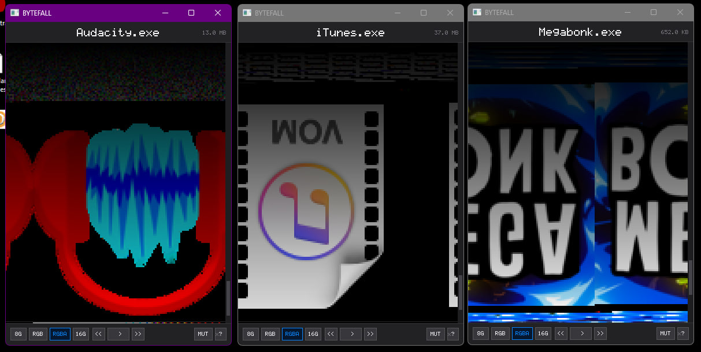
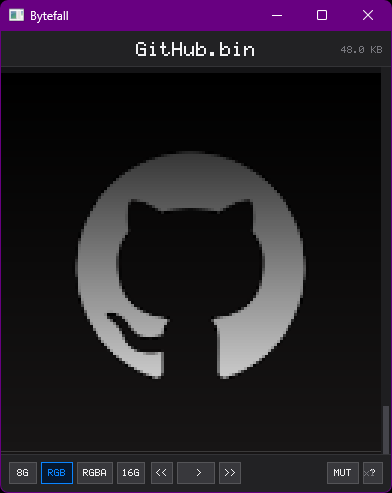

# BYTEFALL

Renders any file as pixels and plays it as audio
# Build
### Windows
> Requires MSYS2 + UCRT64.
```bash
pacman -S mingw-w64-ucrt-x86_64-SDL2
```
```bash
gcc -Wall -O2 -mwindows bytefall.c -o bytefall.exe   -Wl,-Bstatic -lmingw32 -lSDL2main -lSDL2   -Wl,-Bdynamic -lsetupapi -lole32 -loleaut32 -limm32 -lwinmm -lversion -luuid   -static-libgcc -static-libstdc++
```
### Linux
> Requires SDL2
```bash
sudo apt install libsdl2-dev
```
```bash
gcc bytefall.c -o bytefall $(sdl2-config --cflags --libs) -lm
```
### macOS
> Requires SDL2 via Homebrew
```bash
brew install sdl2
```
```bash
gcc bytefall.c -o bytefall $(sdl2-config --cflags --libs) -lm
```

# Usage
Drag and drop any file onto the window or pass it as an argument:
    ./bytefall myfile.bin

# Pixel modes
| Mode | Bytes per pixel |
| :---:| :---: |
| 8G | 1 - grayscale | 
| RGB | 3 - color (default) | 
| RGBA | 4 - color with alpha | 
| 16G | 2 - 16-bit grayscale | 

# Controls
| Key | Action |
| :---: | :---: |
| `Space` | Play / Pause |
| `R` | Restart |
| `M` | Mute |
| `↑` / `↓` | Speed |
| `?` | Help |
| Mouse wheel | Scroll |

# IMG2BIN
You can create images like that using [img2bin](https://github.com/encrize/image-to-bin)


made by encrize , my website - https://encrize.vip
