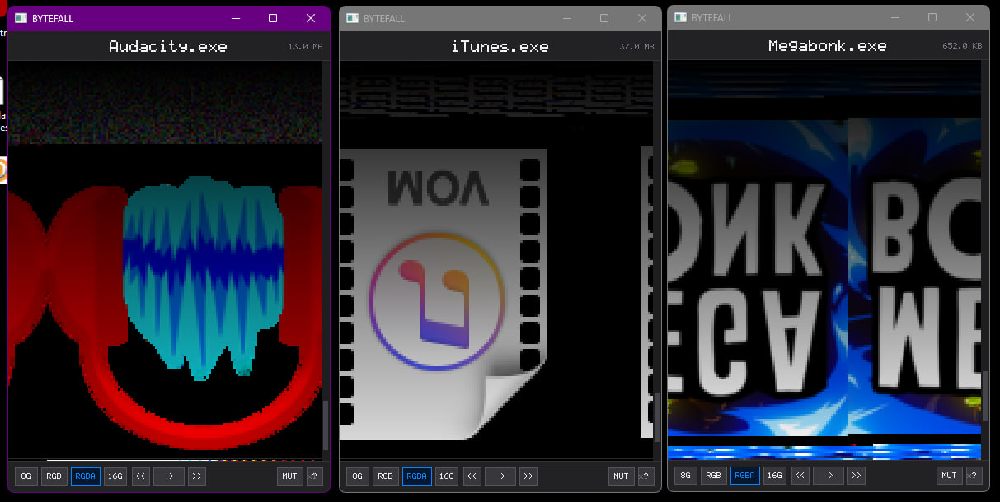
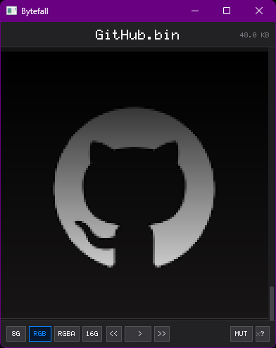

# Bytefall



A lightweight binary file visualizer and raw audio player built with C and SDL2. Bytefall renders any file as a scrolling pixel waterfall and plays its bytes as an audio signal.

## Features

- 8-bit grayscale, 16-bit grayscale, RGB, and RGBA modes
- Smooth SDL2 rendering and real-time zoom
- Raw byte audio playback with speed and volume controls
- Hex tooltips, byte offsets, and a minimap
- Drag-and-drop file loading
- Linux and Windows support

## Build

### Linux

#### Arch Linux

```bash
sudo pacman -S --needed base-devel sdl2
make
```

#### Debian / Ubuntu

```bash
sudo apt install build-essential pkg-config libsdl2-dev
make
```

The executable is created as `./bytefall`.

### Windows

Install [MSYS2](https://www.msys2.org/), open the **UCRT64** terminal, and run:

```bash
pacman -Syu
pacman -S --needed make mingw-w64-ucrt-x86_64-gcc mingw-w64-ucrt-x86_64-pkgconf mingw-w64-ucrt-x86_64-SDL2
make
```

The executable is created as `bytefall.exe`. To run it outside the MSYS2 terminal, copy the SDL2 runtime next to it:

```bash
cp /ucrt64/bin/SDL2.dll .
```

### Clean build

```bash
make clean
make
```

Use Clang by passing `CC=clang` to `make`.

## Usage

```bash
./bytefall path/to/file.bin
```

On Windows:

```bash
./bytefall.exe path/to/file.bin
```

You can also start Bytefall without an argument and drop a file onto the window.

## Controls

| Input | Action |
| --- | --- |
| `Space` | Play or pause |
| `R` | Restart |
| `M` | Mute or unmute |
| `Up` / `Down` | Change playback speed |
| Mouse wheel | Scroll |
| `Ctrl` + mouse wheel | Zoom |
| `?` / `H` | Show help |
| `Esc` / `Q` | Exit |

## Image conversion

Create compatible binary images with [img2bin](https://github.com/encrize/image-to-bin).



## License

See [LICENSE](LICENSE).
